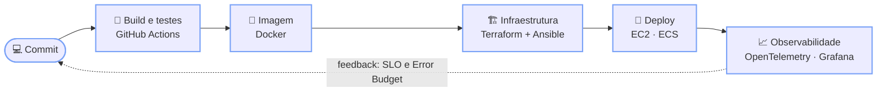

<div align="center">


<br>


</div>

```hcl
resource "developer" "gabriel_stuginski" {
  formacao = "Análise e Desenvolvimento de Sistemas"
  foco     = ["DevOps", "SRE"]
  stack    = ["AWS", "Terraform", "Ansible", "Docker", "Kubernetes"]
  status   = "provisionado e em produção"
}
```

Tenho prática com AWS (EC2, RDS, ECS e outros serviços) e gosto de transformar deploy manual em pipeline, e servidor "configurado na mão" em playbook versionado.

<br>

### 🔁 Meu ciclo DevOps



<br>

### 🔧 Tecnologias

<div align="center">

**☁️ Cloud & Infraestrutura como Código**<br>


**🐳 Containers & Orquestração**<br>


**🔄 CI/CD & Versionamento**<br>


**📈 SRE & Observabilidade**<br>


**🐧 Linux & Redes**<br>


**💻 Linguagens & Frameworks**<br>


</div>
<br>

### 🎓 Formação & cursos

<div align="center">

🎓 **Análise e Desenvolvimento de Sistemas**

✅ Formação **DevOps** concluída (224h) · [ver certificado](https://cursos.alura.com.br/user/stug9000/fullCertificate/16f3dcf43ca62aabb633ff2dd6c6760e)
✅ Concluídos: **SRE** · **Integração Contínua** · **Infraestrutura como Código** · **Redes** · **Kubernetes** · **Observabilidade**
🤖 **Google AI Essentials** · Coursera · ago/2026 · [verificar certificado](https://coursera.org/verify/specialization/HTSUKHAJ2X73)
🎯 Próximo passo: projeto prático com **Kubernetes** e **observabilidade**
</div>

<details>
<summary><b>Ver todos os cursos (224h no total)</b></summary>
<br>

**DevOps**
- Explorando conceitos, comandos e scripts no Linux CLI — 22/11 a 27/11/2025 · 8h
- Trabalhando com tráfego seguro em comunicações web — 27/11 a 05/12/2025 · 6h
- Trabalhando com repositórios no GitHub — 05/12 a 16/12/2025 · 8h
- Construindo e gerindo containers com o Docker — 16/12/2025 a 13/01/2026 · 8h
- Shift Left e DevOps: otimizando o ciclo de desenvolvimento de software — 04/03 a 05/03/2026 · 2h

**Integração Contínua**
- Pipelines e testes automatizados com GitHub Actions — 14/01 a 04/02/2026 · 8h
- Pipeline Docker no GitHub Actions — 04/02 a 11/02/2026 · 8h
- GitHub Actions: integrando e entregando código com segurança — 22/03 a 09/04/2026 · 8h
- Entrega Contínua: confiabilidade e qualidade na implantação de software — 12/03 a 22/03/2026 · 8h
- Pipeline de entrega e implementação contínua na EC2 — 11/05 a 10/06/2026 · 8h
- Automatize o deploy no Amazon ECS — 13/06 a 15/06/2026 · 8h
- Rollback e teste de carga — 10/06 a 22/06/2026 · 8h

**Infraestrutura como Código**
- Preparando máquinas na AWS com Ansible e Terraform — 14/01 a 17/01/2026 · 8h
- Ansible: implementando sua infraestrutura como código — 17/01 a 23/01/2026 · 10h

**Kubernetes**
- Orquestrar aplicações, escalabilidade e segurança — 09/07 a 17/08/2026 · 16h
- Pods, Services e ConfigMaps — 20/08 a 07/09/2026 · 8h

**Linux & Terminal**
- Linux Onboarding: obtendo e tratando informações do sistema — 15/02 a 21/02/2026 · 8h
- Linux Onboarding: trabalhe com usuários, permissões e dispositivos — 21/02 a 24/02/2026 · 8h
- Linux: gerenciando diretórios, arquivos, permissões e processos — 24/02 a 04/03/2026 · 8h
- Terminal: aprenda comandos para executar tarefas — 14/02 a 15/02/2026 · 10h
- Docker: criando e gerenciando containers — 23/01 a 29/01/2026 · 10h

**Redes**
- Dos conceitos iniciais à criação de uma intranet — 22/04 a 27/04/2026 · 12h
- Construindo um projeto com VLANs, políticas de acesso e conexão com internet — 19/04 a 08/05/2026 · 8h

**SRE**
- Carreira SRE: boas-vindas e primeiros passos — 13/02/2026 · 2h
- SRE: entenda a confiabilidade dos sistemas — 05/03 a 12/03/2026 · 8h
- Confiabilidade e SRE: métricas, Error Budget e resiliência — 09/04 a 19/04/2026 · 10h
- Checkpoint SRE - Nível 1 — 06/07 a 09/07/2026 · 2h

**Observabilidade**
- Integrar métricas, logs e traces com OpenTelemetry e Grafana — 22/06 a 02/07/2026 · 8h

</details>
<br>

### 📌 Projetos em destaque

| Projeto | Descrição | Stack |
|---|---|---|
| [FINAN-ASPRO](https://github.com/STUG9000/FINAN-ASPRO) | Sistema de finanças pessoais completo — projeto final de faculdade | React · TypeScript · Terraform · Ansible |
| [sre-prova-nivel1](https://github.com/STUG9000/sre-prova-nivel1) | Checkpoint prático de SRE: deploy, rollback e monitoramento | Python · Flask · Docker |
| [DOCKER-CI](https://github.com/STUG9000/DOCKER-CI) | API com 5 pipelines de CI/CD (build, Docker, EC2, ECS, load test) | Go · Docker · GitHub Actions |
| [iac-terraform-ansible](https://github.com/STUG9000/iac-terraform-ansible) | Provisionamento de EC2 com Terraform + configuração via Ansible | Terraform · Ansible · AWS |

<div align="center">

**⚙️ Pipelines ao vivo**<br>
[](https://github.com/STUG9000/integracao-continua-go/actions)
[](https://github.com/STUG9000/FINAN-ASPRO/actions)

</div>
<br>

### 📊 Estatísticas

<div align="center">


<br>


</div>
<br>

### 📫 Contato

<div align="center">

[](https://www.linkedin.com/in/gabriel-stuginski-b9b5132b1/)
[](mailto:stug9000@gmail.com)


</div>
